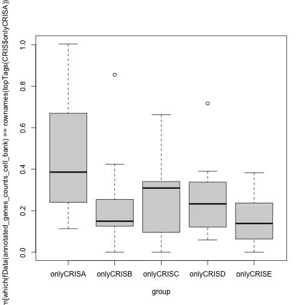
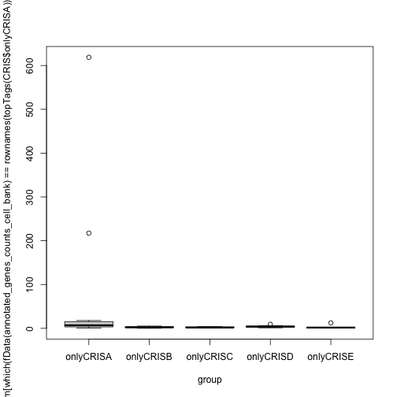

---
title: "Metodological explanations"
output: html_document


## Data description

I have a matrix of 158 samples. I want to run DGE for several groups. I might have situations when I need to compare mutually exclusive 
groups.
The default proceding with the edgeR package is to perform a pairwise comparison among the mutually exclusive groups.
However, my goal is to be able to extract genes which are charachteristic of each group, and therefore, have a significatively higher or lowe 
expression in a group compared to all others.

To do this, edgeR allows you to set a contrast variable, which determines the relationship among different cclasses in the design of your 
model


```r
contrasts <- makeContrasts(A_vs_B_C_D_E = A - (B + C + D + E), levels = design)
```
The end result would be the following:
Contrast
Levels              A_vs_B_C_D_E
  A                             1
  B                            -1
  C                            -1
  D                            -1
  E                            -1

In the context of my analysis, I designed a function which allows me to set this kind of contrast whenever the groups involved are more than 
3, as when the annotations in my dataset have 3 or 2 groups, the intended comparison is a pairwise one. Also, the intercept is excluded from 
the design.


```r
        custom_DGE <- function(x=counts_matrix,group=group){
                rownames(x)<- fData(annotated_genes_counts_cell_bank)$Geneid
                data <- DGEList(counts=x,group=group)
                keep <- filterByExpr(data)
                filt_data <- data[keep,,keep.lib.sizes=FALSE]
                filt_data <- normLibSizes(filt_data)
                design <- model.matrix(~0+group)
                filt_data <- estimateDisp(filt_data,design)
                if(length(levels(group))>3){
                        results <- list()
                        for(i in 1:length(levels(group))){
                                contrast <- rep(-1,length(levels(group)))
                                contrast[i] <- 1
                                fit <- glmFit(filt_data, design)
                                results[[i]] <- glmLRT(fit, contrast=contrast)
                        }
                        names(results) <- levels(group)
                }else{
                        fit <- glmFit(filt_data, design)
                        results <- glmLRT(fit)
                }
                return(results)
        }
```

I will now demonstrate how the function works and which are the results.
This is what the initial count matrix, filtered according to the groups of choice, looks like:


```r
counts_matrix <- exprs(annotated_genes_counts_cell_bank)[,grep("only",pData(annotated_genes_counts_cell_bank)$CRIS_class)]
dim(counts_matrix)
```

```
## [1] 61228    57
```

```r
head(counts_matrix)
```

```
##   C10S1.STAR C32.STAR C70.STAR C75.STAR CACO2.STAR COCM1.STAR COGA122.STAR
## 1         10        1        0       14          7          2            7
## 2          0        0        0        0          0          0            0
## 3          1       49        8        3          3          9            1
## 4          7        8        5        1          4         20            4
## 5          0        0        0        0          0          0            0
## 6          0        0        0        0          0          0            0
##   COGA2.STAR COGA5.STAR COGA5L.STAR COLO3202.STAR COLO678.STAR COLO94H2.STAR
## 1         12         29          23            13           11             7
## 2          0          0           0             0            0             0
## 3         29          5           6             0            8             1
## 4         16          8           7             3           11             1
## 5          0          0           0             0            1             0
## 6          0          0           0             0            0             0
##   HCA24.STAR HCD9.STAR HDC8.STAR HDC82.STAR HROC18.STAR HROC183.STAR
## 1         10         8         3          1          19           24
## 2          0         0         0          0           0            0
## 3          3        23         8          4           0           12
## 4         15         5         5          6           0            8
## 5          0         0         0          0           0            0
## 6          0         0         0          0           0            0
##   HROC239.STAR HROC24NT.STAR HROC284MetP34RNA03042015.STAR
## 1            1            17                             0
## 2            0             0                             0
## 3            2             3                            23
## 4            6             4                            27
## 5            0             0                             0
## 6            0             0                             0
##   HROC43P43RNA28102014PRM.STAR HROC57.STAR HROC60P4918112014PRM.STAR HT29.STAR
## 1                            2          16                        10        65
## 2                            0           0                         0         0
## 3                            3           7                         4         7
## 4                           13          11                         6        21
## 5                            0           0                         0         0
## 6                            0           0                         0         0
##   HUTU80.STAR IRCC22.STAR KM20.STAR KP363T.STAR LIM1215.STAR LS1030.STAR
## 1          15           3        32           1           14           8
## 2           0           0         0           0            0           0
## 3          34           2         2           2            5           0
## 4           6           4         3           2            3           0
## 5           0           0         0           0            0           0
## 6           0           0         0           0            0           0
##   LS180.STAR LS180S23.STAR LS513P21RNA28032018.STAR MDST8.STAR OUSM23.STAR
## 1         12            11                       14         44           0
## 2          0             0                        0          0           0
## 3          6             2                        3         32           0
## 4         12            11                        9          6           4
## 5          0             0                        2          0           0
## 6          0             0                        0          0           0
##   OXCO2.STAR OXCO3.STAR RCM1.STAR SKCO1.STAR SNU1033.STAR SNU1684.STAR
## 1         14         12        37         56            0            1
## 2          0          0         0          0            0            0
## 3          3          0         5          2            2            2
## 4         13          5        12         10            3           15
## 5          0          0         0          0            0            0
## 6          0          0         0          0            0            0
##   SNU1746.STAR SNU175.STAR SNU503.STAR SNU81S15.STAR SNUC1.STAR SW1116.STAR
## 1           24           5           2             0          3           8
## 2            0           0           0             0          0           0
## 3            3           4           9             5          6           3
## 4            3           9          13            16         10           7
## 5            0           0           0             0          0           0
## 6            0           0           0             0          0           0
##   SW1222.STAR SW1463.STAR SW480.STAR SW620S14.STAR SW837.STAR V411.STAR
## 1           8           8          3             6         21         8
## 2           0           0          0             0          0         0
## 3           4           1          1             1          6         6
## 4          14           3          5             4          9        10
## 5           0           1          0             0          0         0
## 6           0           0          0             0          0         0
##   V481.STAR WIDR.STAR
## 1         7        49
## 2         0         0
## 3        45         4
## 4         6         2
## 5         0         0
## 6         0         0
```

The groups are the following:


```r
group <- factor(pData(annotated_genes_counts_cell_bank)$CRIS_class[grep("only",pData(annotated_genes_counts_cell_bank)$CRIS_class)])
levels(group)
```

```
## [1] "onlyCRISA" "onlyCRISB" "onlyCRISC" "onlyCRISD" "onlyCRISE"
```

The function is run as


```r
CRIS <- custom_DGE(counts_matrix,group)
topTags(CRIS$onlyCRISA)
```

```
## Coefficient:  1*grouponlyCRISA -1*grouponlyCRISB -1*grouponlyCRISC -1*grouponlyCRISD -1*grouponlyCRISE 
##                    logFC     logCPM       LR PValue FDR
## SRD5A3-AS1      67.17348 -1.3371965 1770.758      0   0
## ENSG00000260273 66.01549 -1.2770107 1676.242      0   0
## ENSG00000260874 65.88399 -1.2625701 1620.970      0   0
## PDPR2P          65.85318 -1.1828172 1584.102      0   0
## FAM136DP        65.68862 -0.8263607 2022.769      0   0
## SNORD59A        65.68425 -1.2871324 1593.577      0   0
## KRT18P34        65.67355 -1.1498724 2025.947      0   0
## ENSG00000289334 65.56260 -1.1117962 1647.882      0   0
## ENSG00000269910 65.44629 -1.1936880 2068.190      0   0
## ENSG00000241962 65.39978 -1.1262722 2248.213      0   0
```

with these being the top 10 results from the analysis. However, when visualizing these results on cpm expression data, it seems clear that 
something does not add up. FDR are recurrently very low, and the distribution of cpm in class A is not truly differential.


```r
cpm <- apply(counts_matrix,2,function(x){x*1000000/sum(x)})
boxplot(cpm[which(fData(annotated_genes_counts_cell_bank)==rownames(topTags(CRIS$onlyCRISA))[1]),]~group)
```



Therefore, after searching in literature, I found the following article:

[A guide to creating design matrices for gene expression experiments]("https://www.ncbi.nlm.nih.gov/pmc/articles/PMC7873980/")

In the "control versus the rest" paragraph, it confirms that keeping the groups separate is the best choice, and offers 2 alternatives:

- Running all possible pairwise combinations for that group and retaining genes that are considered as differentially expressed in all of 
them 

- Calculating the average mean gene expression in the "rest" group, designing the contrast matrix as follows:

makeContrasts((treatmentI+treatmentII+treatmentIII)/3-treatmentCTL,
  levels=colnames(design))

##               Contrasts
## Levels         (treatmentI + treatmentII + treatmentIII)/3 - treatmentCTL
##   treatmentCTL                                                      -1.00
##   treatmentI                                                         0.33
##   treatmentII                                                        0.33
##   treatmentIII                                                       0.33

To limit computational time and facilitate the design, I proceded to calculate contrast as follows, and repeated the analysis


```r
        custom_DGE <- function(x=counts_matrix,group=group){
                rownames(x)<- fData(annotated_genes_counts_cell_bank)$Geneid
                data <- DGEList(counts=x,group=group)
                keep <- filterByExpr(data)
                filt_data <- data[keep,,keep.lib.sizes=FALSE]
                filt_data <- normLibSizes(filt_data)
                design <- model.matrix(~0+group)
                filt_data <- estimateDisp(filt_data,design)
                if(length(levels(group))>3){
                        results <- list()
                        for(i in 1:length(levels(group))){
                                contrast <- rep(-(1/(length(levels(group))-1)),length(levels(group)))
                                contrast[i] <- 1
                                fit <- glmFit(filt_data, design)
                                results[[i]] <- glmLRT(fit, contrast=contrast)
                        }
                        names(results) <- levels(group)
                }else{
                        fit <- glmFit(filt_data, design)
                        results <- glmLRT(fit)
                }
                return(results)
        }
```

Results in this way are notably more coherent


```r
CRIS <- custom_DGE(counts_matrix,group)
topTags(CRIS$onlyCRISA)
```

```
## Coefficient:  1*grouponlyCRISA -0.25*grouponlyCRISB -0.25*grouponlyCRISC -0.25*grouponlyCRISD -0.25*grouponlyCRISE 
##                    logFC     logCPM       LR       PValue          FDR
## ANO7            4.493869  4.1294198 80.19097 3.399165e-19 6.761959e-15
## MUC5B           6.292940  5.2212824 68.87831 1.047302e-16 9.519970e-13
## PIGR            7.752567  6.9943168 68.25630 1.435676e-16 9.519970e-13
## DLEC1           3.808678  2.7695894 64.16664 1.143283e-15 5.685833e-12
## FCGBP           5.214440  6.2558378 62.41946 2.775665e-15 1.104326e-11
## EIF5AL1         3.536682  1.7035764 60.28975 8.187270e-15 2.714489e-11
## LINC01088       4.624556  1.0526559 58.61516 1.917330e-14 5.448779e-11
## ENSG00000286750 3.913916 -0.6327786 54.49692 1.556920e-13 3.766195e-10
## ADGRG2          5.563425  3.2216646 54.31964 1.703903e-13 3.766195e-10
## MROH2A          3.704968  0.3988749 51.50321 7.148007e-13 1.421953e-09
```

```r
boxplot(cpm[which(fData(annotated_genes_counts_cell_bank)==rownames(topTags(CRIS$onlyCRISA))[1]),]~group)
```


These are the reasons and motivations supporting the design of choice in all of the following analysis
